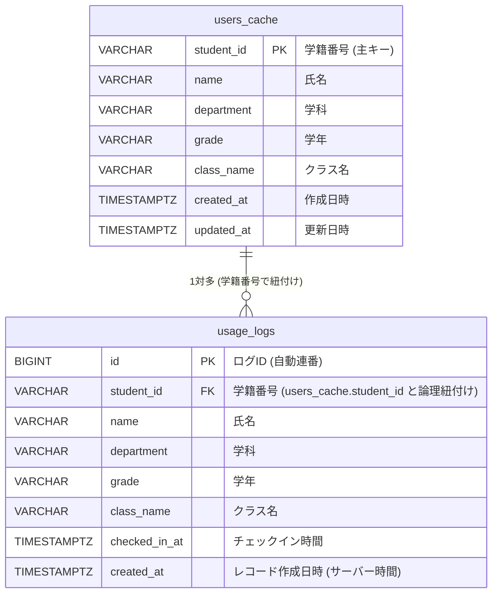
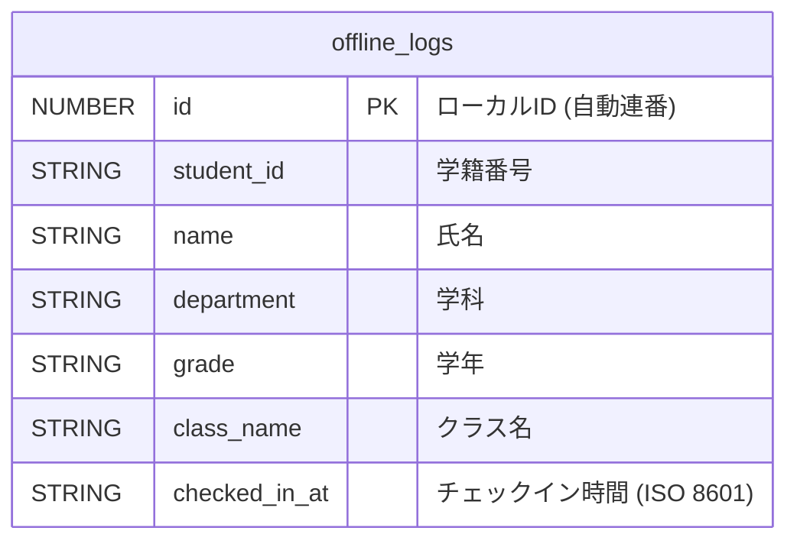

# ジム利用記録システム ER図

本システムのデータベース（Supabase PostgreSQL）におけるエンティティの関連図、およびクライアント端末内のローカル一時保存領域（IndexedDB）のデータ構造を示します。

---

## 1. クラウドデータベース ER図 (Supabase PostgreSQL)

本システムは「マスタ登録なし」で動作しますが、学籍番号（`student_id`）をキーとして、過去の入力情報（`users_cache`）と実際の利用履歴（`usage_logs`）が論理的にリレーションを持っています。

---}

## 2. クライアント側 一時保存データ構造 (IndexedDB)

オフライン時に利用されるクライアントブラウザ内の独立したデータストア構造です。オンライン復帰時に、このデータが順次 `usage_logs` へと送信されます。

---

## 3. リレーションシップおよび運用の補足説明

* **物理キー制約を付与しない理由**:
  * `users_cache` と `usage_logs` の間には、物理的な外部キー制約（FOREIGN KEY）は付与していません。
  * 理由は、最初の利用時には `users_cache` にデータが存在しない状態で `usage_logs` に書き込みが発生するためです。
  * システムの登録処理の流れ：
    1. 利用ログ (`usage_logs`) にデータを登録する。
    2. 入力された学籍番号が `users_cache` に存在しなければ新規作成、存在すれば最新の情報で更新（UPSERT処理）を行う。
  * このように、アプリケーションのビジネスロジック側で整合性を担保するため、データベース上は緩やかな論理リレーションとして扱います。
