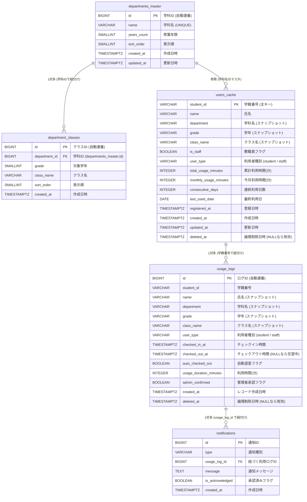
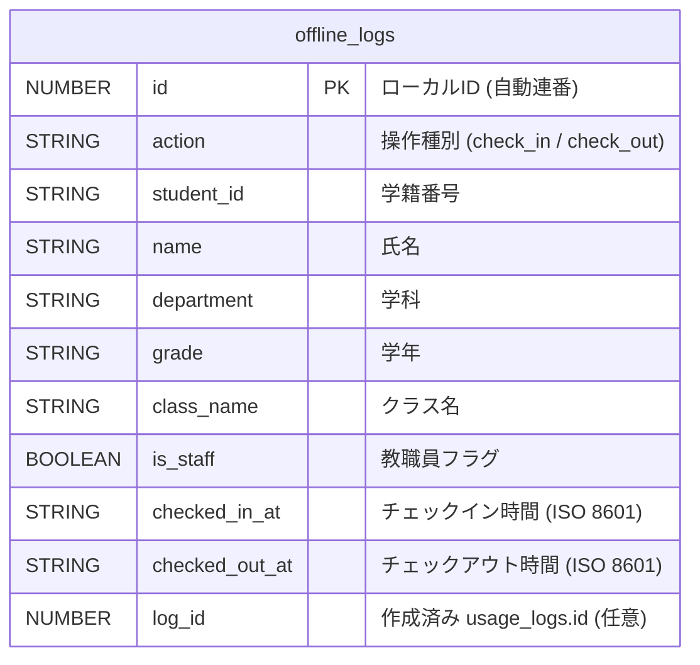

# ジム利用記録システム ER図

<!-- 変更履歴
  2026-06-27 更新:
  - §1 ER図: users_cache / usage_logs に実装済みの user_type / 利用統計 / 自動チェックアウト / 管理者承認カラムを反映
  - §1 ER図: notifications テーブルを追加
  - §2 IndexedDB: 実装上の store 名・action 値・保存項目に合わせて修正
  - §3 補足: オフラインキュー、利用統計、通知の運用を追記
-->

本システムのデータベース（Supabase PostgreSQL）におけるエンティティの関連図、およびクライアント端末内のローカル一時保存領域（IndexedDB）のデータ構造を示します。

---

## 1. クラウドデータベース ER図 (Supabase PostgreSQL)

学科・クラスは `departments_master` / `department_classes` によるマスタ管理を採用し、`users_cache` および `usage_logs` には氏名・学科・学年・クラス名をスナップショットとして非正規化して保存します。さらに、`users_cache` には利用統計情報、`usage_logs` には利用時間・自動退室・管理者承認情報を保持します。

---

## 2. クライアント側 一時保存データ構造 (IndexedDB)

オフライン時に利用されるクライアントブラウザ内の独立したデータストア構造です。オンライン復帰時に、このデータが順次 `usage_logs` へと送信されます。実装上のデータベース名は `JimReserveOfflineStore`、ストア名は `offline_logs` です。

---

## 3. リレーションシップおよび運用の補足説明

### 3.1 マスタテーブルとスナップショット設計
* `departments_master` と `department_classes` は入力フォームの選択肢を提供するマスタです。
* `users_cache` および `usage_logs` の学科名・クラス名は、登録時点のマスタ値をそのまま文字列として保存します（スナップショット）。これにより、マスタのリネームや削除が過去ログに影響しません。
* `department_classes` のみ `departments_master` に対して物理外部キー制約を持ちます（学科削除時にクラスも連動削除）。

### 3.2 users_cache ↔ usage_logs 間の外部キー非設定
* `users_cache` と `usage_logs` の間には、物理的な外部キー制約（FOREIGN KEY）は付与していません。
* 理由は、最初の利用時には `users_cache` にデータが存在しない状態で `usage_logs` に書き込みが発生するためです。
* システムの登録処理の流れ：
  1. 利用ログ（`usage_logs`）にデータを登録する。
  2. 入力された学籍番号が `users_cache` に存在しなければ新規作成、存在すれば最新の情報で更新（UPSERT処理）を行う。
* アプリケーションのビジネスロジック側で整合性を担保するため、データベース上は緩やかな論理リレーションとして扱います。

### 3.3 利用統計・通知の運用
* `users_cache` には `total_usage_minutes`、`monthly_usage_minutes`、`consecutive_days`、`last_used_date` を保持し、ランキングや利用統計の表示に利用します。
* `usage_logs` には `usage_duration_minutes`、`auto_checked_out`、`admin_confirmed` を保持し、退室処理や管理者確認の状態を管理します。
* `notifications` は各利用ログに紐づく通知メッセージを保持し、承認状態を追跡します。

### 3.4 論理削除・自動チェックアウトの運用ルール
* `users_cache` および `usage_logs` の `deleted_at` カラムが `NULL` のレコードのみを「有効」として扱います。
* 管理者が削除操作を行うと `deleted_at` に現在時刻がセットされ、ゴミ箱に移動します。
* ゴミ箱から30日以内であれば復元可能です。
* 30日経過後は自動バッチ処理（またはSupabase Functionによるスケジューラ）により物理削除されます。
* 「現在在室中」は、自動チェックアウト処理を実行した後の `usage_logs.checked_out_at IS NULL AND usage_logs.deleted_at IS NULL` のレコードとして判定します。日付条件は付けません。
* チェックイン後15時間が経過しても `checked_out_at` が記録されていない場合は、バッチまたはAPI呼び出し時に自動で `checked_out_at = checked_in_at + INTERVAL '15 hours'`、`usage_duration_minutes = 30`、`auto_checked_out = TRUE`、`is_adjusted = TRUE`、`is_notified = FALSE` を設定します。
