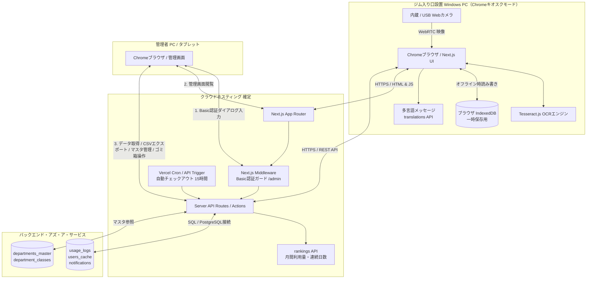

# ジム利用記録システム システム構成図

<!-- 変更履歴
  2026-06-27 更新:
  - §1 システム構成図: 利用統計・ランキング・多言語翻訳 API を追加
  - §2 データフロー: オフライン同期、利用統計更新、管理画面タブ表示のフローを追記
-->

本システムの物理的・論理的なシステム構成図およびデータフローを記述します。本システムはVercelとSupabaseを利用した完全クラウド型Webアプリケーションであり、利用者向け画面・管理者画面・オフライン同期を統合的に提供します。

---

## 1. 物理・論理システム構成

システムは、ジムの入り口に配置する「フロントエンド端末（PCブラウザ）」、ホスティング・Webサーバー機能を提供する「Vercel」、およびデータベースを担う「Supabase」の3層で構成されます。管理者認証にはNext.jsのミドルウェアを用いたシンプルなBasic認証を採用しています。

---

## 2. データフローおよびプロトコル

本システム内のデータ通信は、以下のように制御されます。

1. **映像入力とOCR（完全ローカル処理）**
   * カメラ映像（WebRTC）をブラウザ内の Tesseract.js に渡し、学籍番号を抽出します。
   * 通信プロトコル: ブラウザのメインスレッドとWeb Worker間のメッセージング（外部通信なし）。

2. **チェックイン登録（オンライン時 / HTTPS）**
   * フロントエンド UI から Vercel (Next.js) へチェックイン情報を送信し、Vercel から Supabase PostgreSQL に即時保存されます。
   * 同時に `users_cache` をUPSERTし、次回以降の自動補完に備えます。
   * 通信プロトコル: HTTPS（API / JSONデータ）。

3. **チェックイン登録（オフライン時 / ローカル一時保存）**
   * ネットワーク接続がない場合、ブラウザ内の IndexedDB にデータを保存し、画面上は一時的に完了状態にします。
   * 通信プロトコル: ブラウザ標準 API（外部通信なし）。

4. **オンライン自動復帰同期（HTTPS）**
   * フロントエンドがオンライン復帰を検知すると、IndexedDB にたまっている未同期データを Vercel の API 経由で Supabase へ順次同期します。
   * 通信プロトコル: HTTPS。

5. **管理者アクセス（HTTPS + Basic認証）**
   * 管理者が管理者画面（Vercel上の `/admin` パス以下）にアクセスする際、Next.js MiddlewareがHTTPヘッダーの `Authorization`（Basic認証トークン）を検証します。
   * 正しいユーザー名・パスワードが入力されていない場合、HTTP `401 Unauthorized` を返し、ブラウザにIDとパスワードの入力を求めるポップアップを表示させます。
   * 通信プロトコル: HTTPS / SSL。

6. **チェックアウト登録（オンライン時 / HTTPS）**
   * 学籍番号入力後、APIが未チェックアウトの `usage_logs` レコードを検索します。該当がある場合、フロントエンドはチェックアウト確認画面を表示します。
   * 利用者が確認ボタンを押すと、対象レコードの `checked_out_at` に現在時刻がセットされます。
   * 通信プロトコル: HTTPS（API / JSONデータ）。

7. **自動チェックアウト（Vercel Cron / 定期処理）**
   * Vercel Cronジョブが定期的（例: 1時間ごと）にAPIを呼び出し、チェックイン後15時間以上が経過しているにもかかわらず `checked_out_at` が NULL のレコードを検索・更新します。
   * 通信プロトコル: Vercel内部呼び出し → Supabase PostgreSQL接続。

8. **利用統計・ランキング表示**
   * チェックイン／チェックアウト完了後、利用時間・月間利用分・連続利用日数を `users_cache` に反映し、ランキング API から管理画面や利用者画面に配信します。
   * 通信プロトコル: HTTPS / JSON。