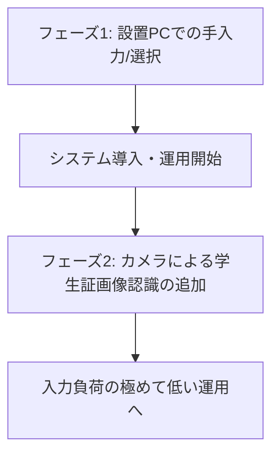

# ジム利用記録システム 企画書

## 1. 背景と課題

現在、ジムの入り口において、利用者が紙の台帳に「利用日時」「クラス（学科・学年）」「氏名」等を手書きで記入することで利用記録を残しています。
この運用には以下の課題があります。

- **記入・集計の手間**: 手書きによる記入ミスや漏れが発生しやすく、後からのデータ集計や確認にコストがかかる。
- **入力のハードル**: 利用者側の入力負荷は最小限にする必要がある。
- **ITリテラシーへの配慮**: 全ての利用者がITに強いわけではない（建築や国際など、様々な学科の学生が利用する）。そのため、複雑なマイページ登録や個別アカウントの作成・ログインを求める運用は浸透しない懸念がある。
- **導入・運用コスト**: 物理的な会員証（QRコード付き）を全員（約800名分）に発行・貼付するようなコストや手間は許容されない。

---

## 2. システムの目的

ジムの入り口に端末を設置し、シンプルかつ直感的な操作で「誰が・いつ利用したか」をデジタルデータとして記録・管理できるシステムを構築します。
利用者の入力負荷（ハードル）を下げつつ、管理者側で確実に利用記録（学籍番号、氏名、クラス等）を把握できることに加え、利用統計・ランキング・多言語表示による運用の利便性向上も目指します。

---

## 3. 要件定義

### 必須要件（最低要件）
- **利用記録のデジタル保存**: 「日時」「クラス（学科・学年）」「学籍番号/氏名」のデータを保存できること。
- **簡易な入力インターフェース**: 利用者が迷わず、短時間で入力を完了できること。
- **統計・ランキング表示**: 利用時間や連続利用日数の可視化により、運用管理者と利用者双方が現状を把握できること。
- **多言語対応**: 日本語・英語のメッセージを切り替え、利用者の理解しやすさを高めること。
- **安価な設備構成**: 専用ハードウェアを多数導入するのではなく、既存のPCやタブレット、カメラなどの最小限の構成で実現できること。

### 検討された入力アイデアと評価
| アイデア | メリット | デメリット/懸念点 | 採用可否 |
| :--- | :--- | :--- | :--- |
| **マイページ/個別アカウント方式** | 個人に紐づく正確なデータが取れる | アカウント作成やログインの手間があり、ITリテラシーの違いから浸透しない懸念。管理コスト高。 | 見送り |
| **全員にQRコード会員証を発行** | スキャンするだけで瞬時に完了 | 800人分のQRコード印刷・配布コストがかかる。 | 見送り |
| **タブレット/PCでの手動選択・入力** | 特別な機器が不要で、導入コストが最も低い | 手入力の手間が多少発生する。セキュリティ面の懸念（PC置きっぱなしによる悪戯など）。 | **採用（フェーズ1）** |
| **学生証の画像認識（OCR等）** | 学生証をかざすだけで自動入力され、入力負荷が極めて低い | 実装難易度が手入力より高い。 | **採用（フェーズ2）** |

---

## 4. 開発ロードマップ

システムの早期導入と確実な稼働を狙い、開発を2つのフェーズに分けて段階的に進めます。

### 【第1フェーズ】PC設置・手動入力システム
- **概要**: ジム入り口にノートPC（またはタブレット）を1台常時設置し、利用者が画面上で情報を入力・選択する。
- **入力フロー**:
  1. 画面上で「学科」「学年」「クラス」をリストから選択。
  2. 「学籍番号」または「氏名」を入力（または選択）。
  3. 「チェックイン（入室）」ボタンを押して完了。
- **メリット**:
  - 最も開発コストが低く、即座に運用を開始できる。
  - 入力された情報はデータベース（またはスプレッドシート等）に確実に蓄積される。

### 【第2フェーズ】学生証の自動画像認識（OCR/画像認識）の導入
- **概要**: 第1フェーズで構築したシステムに、PC内蔵カメラ（または安価なWebカメラ）による画像認識モジュールを追加する。
- **入力フロー**:
  1. 利用者がPCのカメラに「学生証」をかざす。
  2. カメラ画像から学籍番号や氏名を自動的に読み取る（自動スキャン）。
  3. 読み取った情報をシステムに渡し、自動でチェックインが完了する。
- **メリット**:
  - 利用者の入力ハードルがほぼゼロになり、スムーズな入退室が可能になる。
  - **設計のポイント**: 
    - 入力方法が「手入力」から「カメラ認識」に変わるだけで、その後の「データを保存する」というコアシステム（後続処理）は第1フェーズのものをそのまま流用します。
    - これにより、カメラ認識の導入が遅れたり、万一カメラ認識が失敗したりした場合でも、手入力システムがバックアップとして機能するため、システム全体への影響やリスクを最小限に抑えられます。
