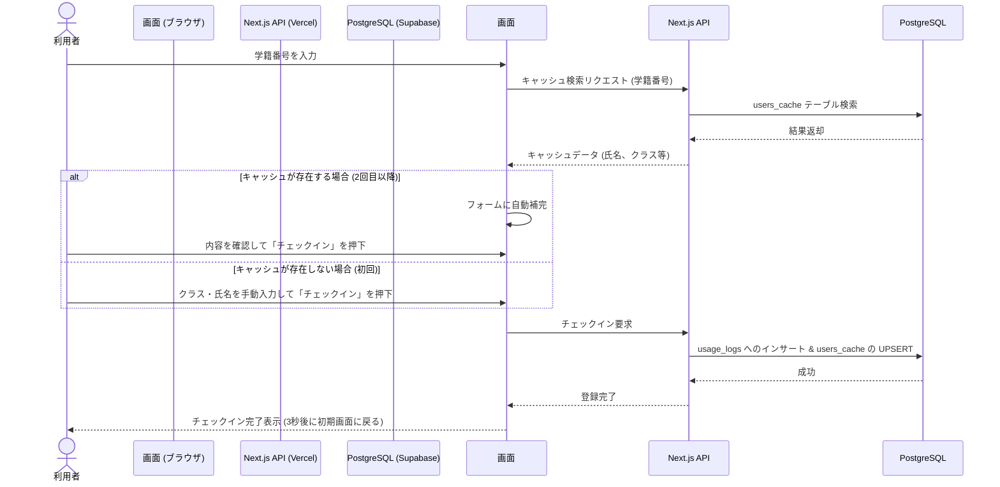
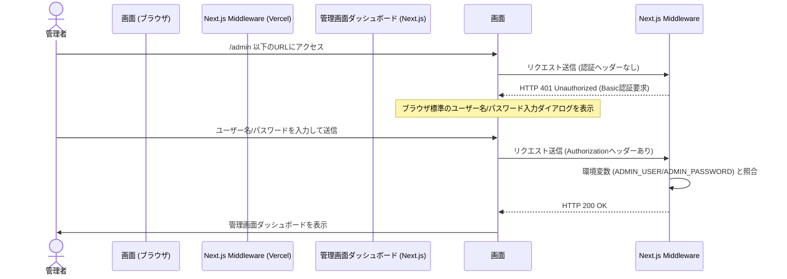

# ジム利用記録システム 基本設計書

## 1. システム概要
本システムは、ジムの入り口に設置したWindows PC（ブラウザ画面）を利用して、利用者が「入室記録」を簡便に登録するためのシステムです。
クラウドインフラとして **Vercel**（Webアプリケーションホスティング）と **Supabase**（クラウドデータベース）を採用し、設置端末にはサーバー環境やデータベース環境を一切構築することなく、Webブラウザの全画面表示のみで稼働します。

## 2. システムの特徴・設計方針
1. **クラウドネイティブかつゼロ・ローカル設定**:
   * ローカルPCにはNode.jsやSQLiteなどの環境構築が一切不要です。ブラウザでVercel上の特定URLを開くだけで即座に動作します。
2. **簡易な操作性とキャッシュによる入力支援（マスタ登録レス）**:
   * 初回利用時のみ「学科・学年・クラス・氏名・学籍番号」を手動入力します。
   * 2回目以降は、学籍番号の入力（または学生証スキャン）だけで、クラウド（Supabase）から取得した情報、またはブラウザ内にキャッシュされた情報が自動補完され、1タップで入室が完了します。
3. **ブラウザIndexedDBを活用したオフライン対応（耐障害性）**:
   * クラウド接続（インターネット）が一時的に切断された場合でも利用できるように、ブラウザ内のデータベース `IndexedDB` にログを一時保存します。
   * ネットワーク復旧（オンライン復帰）時に、バックグラウンドで未同期ログをSupabaseへと自動的に順次同期します。
4. **Basic認証によるシンプルなWeb管理画面**:
   * 管理画面（`/admin`）を同アプリ内に統合。
   * 開発・管理コスト削減のため、複雑な会員認証（ID/PasswordテーブルやOAuthなど）は導入せず、**Next.js Middleware** を使用したシンプルな **Basic認証** を採用します。
   * 管理者は任意の端末からURLにアクセスし、ブラウザ標準のダイアログに入力するだけで、リアルタイムで利用ログの閲覧、CSVダウンロード、学生キャッシュデータのメンテナンスが行えます。

## 3. 全体システムフロー

### 3.1 チェックインフロー（オンライン・通常時）

### 3.2 チェックインフロー（オフライン・一時切断時）

### 3.3 管理者ログインフロー（Basic認証）

## 4. 関連ドキュメント
詳細な設計情報については、以下の各ドキュメントを参照してください。

* **機能一覧**: [機能一覧.md](file:///c:/Users/S002/jimReserve/doc/%E6%A9%9F%E8%83%BD%E4%B8%80%E8%A6%A7.md) - システムが提供する機能の詳細
* **画面設計**: [画面設計.md](file:///c:/Users/S002/jimReserve/doc/%E7%94%BB%E9%9D%A2%E8%A8%AD%E8%A8%88.md) - 各画面のレイアウトと画面遷移
* **技術選定書**: [技術選定書.md](file:///c:/Users/S002/jimReserve/doc/%E6%8A%80%E8%A1%93%E9%81%B8%E5%AE%9A%E6%9B%B8.md) - 採用技術・選定理由・インフラ構成
* **システム構成図**: [システム構成図.md](file:///c:/Users/S002/jimReserve/doc/%E3%82%B7%E3%82%B9%E3%83%86%E3%83%A0%E6%A7%8B%E6%88%90%E5%9B%B3.md) - ハードウェア・ソフトウェアの物理配置と連携
* **データベース定義書**: [データベース定義書.md](file:///c:/Users/S002/jimReserve/doc/%E3%83%87%E3%83%BC%E3%82%BF%E3%83%99%E3%83%BC%E3%82%B9%E5%AE%9A%E7%BE%A9%E6%9B%B8.md) - テーブル設計およびデータ型
* **ER図**: [ER図.md](file:///c:/Users/S002/jimReserve/doc/ER%E5%9B%B3.md) - 各データ要素の関係性
