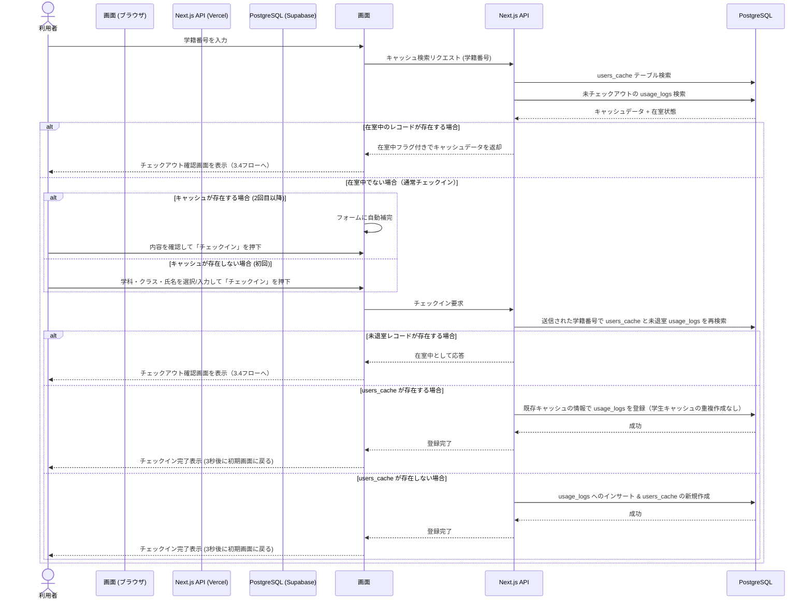
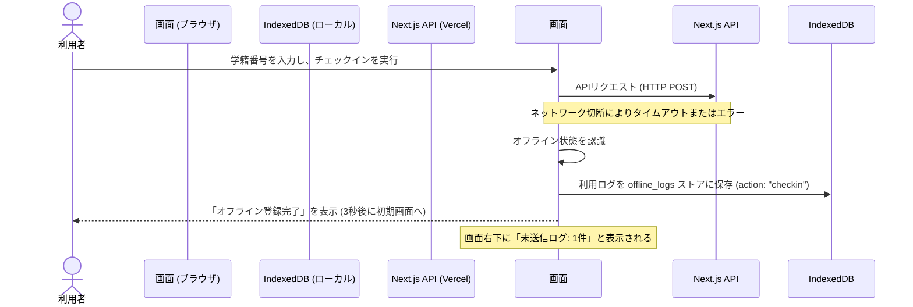
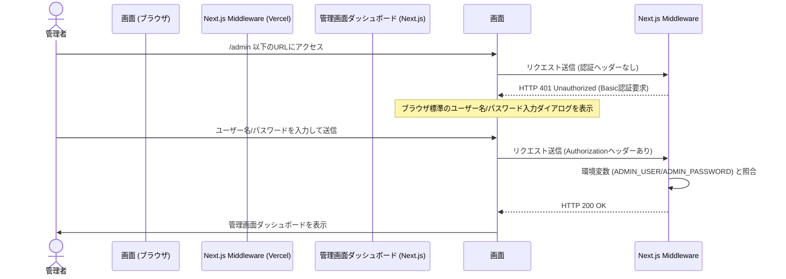
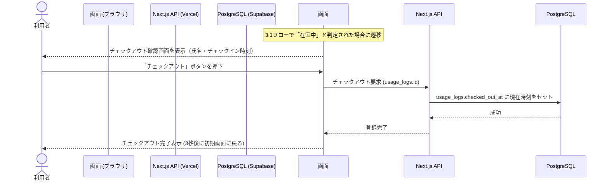
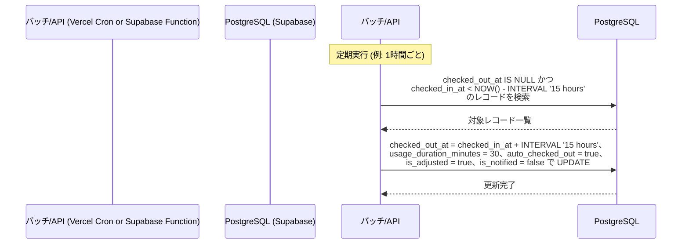

# ジム利用記録システム 基本設計書

<!-- 変更履歴
  2026-06-25 更新:
  - §2.2 設計方針: マスタ管理（departments_master/department_classes）を追加、「マスタ登録レス」の表現を修正
  - §3.1 チェックインフロー: 在室中チェック→チェックアウト確認への自動遷移を追加
  - §3.4 チェックアウトフロー を新規追加
  - §3.5 自動チェックアウトフロー（15時間）を新規追加
-->

## 1. システム概要
本システムは、ジムの入り口に設置したWindows PC（ブラウザ画面）を利用して、利用者が「入室記録（チェックイン）」および「退室記録（チェックアウト）」を簡便に登録するためのシステムです。
クラウドインフラとして **Vercel**（Webアプリケーションホスティング）と **Supabase**（クラウドデータベース）を採用し、設置端末にはサーバー環境やデータベース環境を一切構築することなく、Webブラウザの全画面表示のみで稼働します。

## 2. システムの特徴・設計方針
1. **クラウドネイティブかつゼロ・ローカル設定**:
   * ローカルPCにはNode.jsやSQLiteなどの環境構築が一切不要です。ブラウザでVercel上の特定URLを開くだけで即座に動作します。
2. **マスタ管理による入力精度の確保**:
   * 学科・クラスは `departments_master` / `department_classes` テーブルで管理し、入力フォームは選択式（プルダウン）で提供します。手入力による表記揺れ（`A組`/`Ａ組`等）を防止します。
   * 学年の選択肢は選択した学科の修業年限（`years_count`）に応じて自動的に絞り込まれ、存在しない学年の誤入力を防止します。
   * 2回目以降の利用では、学籍番号の入力だけで `users_cache` から氏名・学科・クラスが自動補完され、1タップで入室が完了します。
   * 手動入力画面に遷移した後に学籍番号が変更された場合でも、変更後の学籍番号を基準にキャッシュ検索・在室状態確認を再実行します。初回登録フォームに入った時点の「キャッシュなし」判定を、その後の登録処理に使い回してはいけません。
   * チェックインAPIは、画面側の状態に依存せず、送信された学籍番号で `users_cache` の存在確認と未退室 `usage_logs` の確認を必ず行います。未退室レコードが存在する場合は即時チェックアウトせず、チェックアウト確認画面で氏名・チェックイン時刻を表示してから退室処理を実行します。
3. **利用統計・ランキング対応**:
   * チェックイン／チェックアウト完了時に利用時間を算出し、`users_cache` の利用統計カラムへ反映します。
   * 管理画面および利用者画面では、月間利用分・連続利用日数のランキングを表示できます。
   * 15時間を超えて自動チェックアウトが発生した場合は、利用時間を実際の経過時間ではなく一律30分として保存し、`usage_logs.is_adjusted = true` とします。次回利用者がシステムへアクセスした際に、`is_adjusted = true AND is_notified = false` の未通知レコードを検出し、指定メッセージを表示してから `is_notified = true` に更新します。
4. **ブラウザIndexedDBを活用したオフライン対応（耐障害性）**:
   * クラウド接続（インターネット）が一時的に切断された場合でも利用できるように、ブラウザ内のデータベース `IndexedDB` にログを一時保存します。
   * ネットワーク復旧（オンライン復帰）時に、バックグラウンドで未同期ログをSupabaseへと自動的に順次同期します。
5. **Basic認証によるシンプルなWeb管理画面**:
   * 管理画面（`/admin`）を同アプリ内に統合。
   * 開発・管理コスト削減のため、複雑な会員認証（ID/PasswordテーブルやOAuthなど）は導入せず、**Next.js Middleware** を使用したシンプルな **Basic認証** を採用します。
   * ユーザー名・パスワードはVercelの環境変数（`ADMIN_USER` / `ADMIN_PASSWORD`）で管理します。
   * 管理者は任意の端末からURLにアクセスし、ブラウザ標準のダイアログに入力するだけで、リアルタイムで利用ログの閲覧、CSVダウンロード、学生キャッシュデータのメンテナンスが行えます。
6. **論理削除による誤操作保護**:
   * `usage_logs`、`users_cache`、`departments_master`、`department_classes` の削除操作はすべて論理削除（`deleted_at` カラムへのタイムスタンプ記録）とし、30日以内であればゴミ箱から復元可能です。
   * 学科を削除した場合は、その学科に紐づくクラスも同時に論理削除し、ゴミ箱では学科単位で復元・完全削除できるものとします。復元時は学科と紐づくクラスをまとめて有効状態へ戻します。
   * 30日を経過した論理削除済みデータ、またはゴミ箱で管理者が「完全削除」を押したデータは物理削除します。

## 3. 全体システムフロー

### 3.1 チェックインフロー（オンライン・通常時）

### 3.2 チェックインフロー（オフライン・一時切断時）

### 3.3 管理者ログインフロー（Basic認証）

### 3.4 チェックアウトフロー（オンライン・通常時）

### 3.5 自動チェックアウトフロー（15時間経過）

## 4. 関連ドキュメント
詳細な設計情報については、以下の各ドキュメントを参照してください。

* **機能一覧**: [機能一覧.md](機能一覧.md) - システムが提供する機能の詳細
* **画面設計**: [画面設計.md](画面設計.md) - 各画面のレイアウトと画面遷移
* **技術選定書**: [技術選定書.md](技術選定書.md) - 採用技術・選定理由・インフラ構成
* **システム構成図**: [システム構成図.md](システム構成図.md) - ハードウェア・ソフトウェアの物理配置と連携
* **データベース定義書**: [データベース定義書.md](データベース定義書.md) - テーブル設計およびデータ型
* **ER図**: [ER図.md](ER図.md) - 各データ要素の関係性
