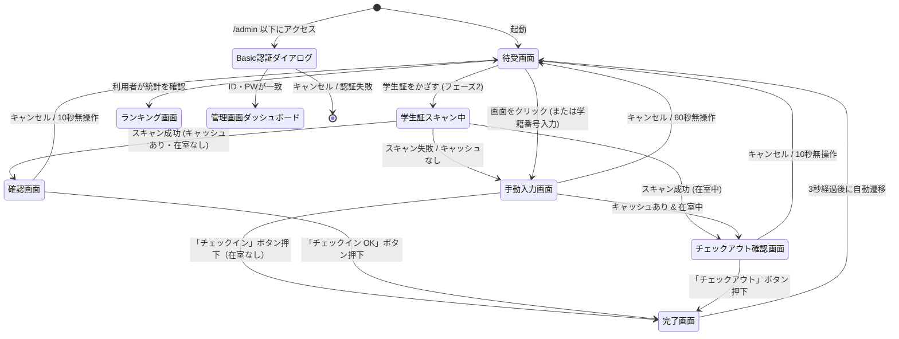

# ジム利用記録システム 画面設計

<!-- 変更履歴
  2026-06-27 更新:
  - §1 画面遷移図: ランキング画面・多言語切替・統計表示を追加
  - §2.1 待受画面: オフライン件数・多言語切替・ランキング表示の追加を反映
  - §2.5 管理画面: stats タブ・ゴミ箱・マスタ管理を反映
-->

利用者が操作するインターフェース（設置端末用）と、管理者が操作するWeb管理画面のレイアウトおよび遷移図です。現在の実装では、待受画面からランキング・統計表示、OCRスキャン、管理者タブ切り替えまで一つの画面遷移で扱います。

---

## 1. 画面遷移図



* **Basic認証ダイアログ**: ブラウザ標準のユーザー名/パスワード入力画面が表示されるため、独自のログイン画面は実装しません。

---

## 2. 各画面のレイアウト設計

### 2.1 待受画面（U-01）
利用者がジムに来た時に最初に目にする画面です。
オフライン時は、画面の右下に「オフライン動作中（未送信: X件）」とステータスが表示されます。

#### 【レイアウトイメージ（フェーズ1）】
```
+-----------------------------------------------------------------+
|                                                                 |
|                  WELCOME TO GYM RECORD SYSTEM                   |
|                                                                 |
|               [ 学籍番号を入力してチェックイン ]                |
|                                                                 |
|                     +---------------------+                     |
|                     |  学籍番号 (例: 12345) |                     |
|                     +---------------------+                     |
|                                                                 |
|                         [ 手動入力で進む ]                      |
|                                                                 |
|                                         [● ONLINE]              |
|                      ※オフライン時は [● OFFLINE (未送信3件)]   |
+-----------------------------------------------------------------+
```

---

### 2.2 手動入力画面（U-04）
初回利用者や、画像スキャンがうまくいかなかった場合に入力する画面です。
学科・学年・クラスはすべてマスタから選択式で提供されます（手入力不可）。
学籍番号欄を編集した場合は、変更後の学籍番号を基準にキャッシュ検索・在室状態確認を再実行します。変更後の学籍番号に未退室レコードがある場合は、即時チェックアウトせずチェックアウト確認画面へ遷移します。

#### 【レイアウトイメージ】
```
+-----------------------------------------------------------------+
|  < 戻る                                       60秒後に戻ります  |
|                                                                 |
|                     ジム利用 登録フォーム                       |
|                                                                 |
|    学籍番号:   +------------------------------------------+     |
|                | 20261001                                 |     |
|                +------------------------------------------+     |
|                *入力すると氏名・クラスが自動で補完されます      |
|                                                                 |
|    氏名:       +------------------------------------------+     |
|                | 山田 太郎                                |     |
|                +------------------------------------------+     |
|                                                                 |
|    学科:       [ 建築学科           v ]  ※マスタから選択       |
|    学年:       [ 2年                v ]  ※学科の修業年限で絞込 |
|    クラス:     [ A組                v ]  ※マスタから選択       |
|                                                                 |
|                     +-----------------------+                   |
|                     |     チェックイン      |                   |
|                     +-----------------------+                   |
|                                                                 |
+-----------------------------------------------------------------+
```

---

### 2.3 チェックアウト確認画面（U-09）
学籍番号入力後、未退室のチェックインが検出された場合に表示される画面です。別の利用者による誤操作・いたずらを抑止するため、この場合のみ即時チェックアウトは行わず、氏名・チェックイン時刻を確認してからチェックアウトボタンを押します。

#### 【レイアウトイメージ】
```
+-----------------------------------------------------------------+
|  < 戻る                                       10秒後に戻ります  |
|                                                                 |
|                    チェックアウト確認                           |
|                                                                 |
|              現在、ジムに入室中の記録があります。               |
|                                                                 |
|              氏名:       山田 太郎                              |
|              チェックイン時刻: 06-25 13:00                      |
|                                                                 |
|                  +-----------------------------+                |
|                  |      チェックアウト          |                |
|                  +-----------------------------+                |
|                                                                 |
|                      [ キャンセル ]                            |
|                                                                 |
+-----------------------------------------------------------------+
```

---

### 2.4.1 通知メッセージ（自動補正告知）
利用者が次回システムへアクセスした際、`is_adjusted = true` かつ `is_notified = false` の未通知レコードが存在する場合、待受画面またはチェックイン画面上に以下のメッセージを表示する。

> 前回のチェックアウト記録が確認できなかったため、一律【30分】として利用時間を記録しました。正しくランキングに反映させるため、お帰りの際は忘れずにチェックアウトをお願いします。

メッセージ表示後は、対象レコードの `is_notified` を `true` に更新する。

### 2.4 ランキング・統計画面（U-10）
利用者が利用時間や連続利用日数を確認できる画面です。管理画面と同じランキングデータを取得し、月間利用分・連続日数の上位を横断表示します。

#### 【レイアウトイメージ】
```
+-----------------------------------------------------------------+
|  < 戻る                                      [日本語 / English] |
|                                                                 |
|                 利用状況ランキング / 統計                      |
|                                                                 |
|  今月の利用時間ランキング                                       |
|  1位  山田太郎  180分  3日連続                                 |
|  2位  佐藤花子  120分  2日連続                                 |
|  3位  鈴木一郎   90分  1日連続                                 |
|                                                                 |
|  連続利用日数ランキング                                         |
|  1位  山田太郎  3日連続                                       |
+-----------------------------------------------------------------+
```

---

### 2.5 管理画面ダッシュボード（A-02〜A-08）
Basic認証成功後に遷移する管理者専用ポータルです。タブで各機能を切り替えられます。独自のログアウト処理は行わず、ブラウザセッションを終了することでログアウトと見なします。

#### 【レイアウトイメージ（利用ログ一覧タブ）】
```
+-----------------------------------------------------------------+
|  ジム利用記録 - 管理パネル                                      |
|  [利用ログ一覧]  [学科・クラス管理]  [利用者キャッシュ管理]  [利用統計]  [ゴミ箱]  |
|-----------------------------------------------------------------|
|  検索フィルタ:                                                  |
|  年:[2026] 月:[06] 日:[12] 学籍番号:[202610  ] 学科:[建築学科 v] |  |
|                                                                 |
|  +-----------------------------------------------------------+  |
|  | [ CSVダウンロード ]                                      |  |
|  +-----------------------------------------------------------+  |
|  |   | 利用日時       | 学籍番号 | 氏名   | クラス | 学科/年 | 操作 |  |
|  |---+-----------------+----------+--------+--------+---------+------|  |
|  |   | 06-25 15:40    | 20261001 | 山田   | 建築2A | 建築学科 2年 | [削除] |  |
|  |   | 06-25 14:15    | 20261005 | 佐藤   | 国際1B | 国際学科 1年 | [削除] |  |
|  | ...                                                       |  |
|  +-----------------------------------------------------------+  |
|  ※削除は各行の「削除」ボタンで実行します。論理削除済みデータはゴミ箱タブで復元可能です。  |
+-----------------------------------------------------------------+
```

#### 【レイアウトイメージ（学科・クラス管理タブ）】
```
+-----------------------------------------------------------------+
|  ジム利用記録 - 管理パネル                                      |
|  [利用ログ一覧]  [学科・クラス管理]  [利用者キャッシュ管理]  [利用統計]  [ゴミ箱]  |
|-----------------------------------------------------------------|
|  [学科を追加] [修業年限を指定]                                    |
|                                                                 |
|  学科一覧                                                      |
|  +-----------------------------------------------------------+  |
|  | 学科名          | 修業年限 | 操作                         |  |
|  |-----------------+----------+-----------------------------|  |
|  | 建築学科        | 2年制    | [学科削除]                   |  |
|  | 国際学科        | 2年制    | [学科削除]                   |  |
|  +-----------------------------------------------------------+  |
|                                                                 |
|  1年: A組  B組  C組      2年: D組  E組                         |
|  [学年を選択] [クラス名入力] [クラス追加]                       |
+-----------------------------------------------------------------+
```

※「学科削除」は物理削除ではなく、対象学科と紐づくクラスをゴミ箱へ移動する。削除後30日以内はゴミ箱から復元可能。

#### 【レイアウトイメージ（ゴミ箱タブ）】
```
+-----------------------------------------------------------------+
|  ジム利用記録 - 管理パネル                                      |
|  [利用ログ一覧]  [学科・クラス管理]  [利用者キャッシュ管理]  [利用統計]  [ゴミ箱]  |
|-----------------------------------------------------------------|
|  ゴミ箱 (削除から30日以内のみ復元可能)                         |
|                                                                 |
|  +-----------------------------------------------------------+  |
|  | 削除日時       | 種別       | 内容                         | 操作                |  |
|  |-----------------+------------+-----------------------------+---------------------|  |
|  | 06-25 10:00    | 利用ログ   | 山田太郎 06-25 13:00 チェックイン | [復元] [完全削除] |  |
|  | 06-24 09:30    | キャッシュ | 佐藤花子 (20261005)             | [復元] [完全削除] |  |
|  | 06-23 11:20    | 学科       | 建築学科（クラス含む）           | [復元] [完全削除] |  |
|  +-----------------------------------------------------------+  |
+-----------------------------------------------------------------+
```

---

## 3. HTML/CSS保守性向上リファクタリング方針

### 3.1 目的
現在の見た目・動作・機能を一切変更せず、画面のどの部分がどのコードに対応するかを直感的に追える構成へ整理する。

### 3.2 厳守事項
- UI表示、操作感、画面遷移、API呼び出し、タイマー、オフライン同期、OCRスキャン、Basic認証配下の管理機能は変更しない。
- 未使用に見える state / 関数 / CSS は削除しない。削除候補は確認事項として残す。
- CSS は素のグローバルCSSを基本とし、`className="xxx"` と `.xxx { ... }` の対応を明確にする。
- 既存クラス名 `btn`, `btn-primary`, `btn-secondary`, `app-container`, `section`, `form-group`, `input-text`, `select-box`, `admin-layout` などは維持する。
- Tailwind、styled-components、CSS Modules の新規導入、BEM への全面移行、新規ライブラリ追加は行わない。
- 動的に計算される値のみ inline style を残してよい。その場合は理由をコメントで明記する。

### 3.3 Next.js / CSS 方針
Next.js 16 の App Router では Global CSS を layout / page / component から import できるが、画面遷移後も stylesheet が残る可能性があるため、CSSの読み込み口は少数に固定する。

- 全体共通: `src/app/globals.css`
- 利用者画面: `src/app/globals.css` を入口とし、画面単位のCSSクラスを章分けして追記する。
- 管理画面: 既存どおり `src/app/admin/page.tsx` から `admin.css` を読み込む。
- CSS分割を行う場合も、最終的な import 入口は `globals.css` と `admin.css` に集約し、CSS適用順を変えない。

### 3.4 利用者画面の分割案
利用者画面は、独立した「画面」として十分な分量があるものを個別ファイル化する。一方、30行未満になりそうな小さな表示部品は、ファイル数が増えすぎて追いにくくなるため、原則として個別ファイル化しない。

`screen` state の値は小文字＋ハイフン区切り、画面コンポーネントのファイル名は PascalCase＋`Screen` で統一する。例: `checkin-confirm` → `CheckInConfirmScreen.tsx`、`checkout-confirm` → `CheckOutConfirmScreen.tsx`、`form` → `ManualEntryScreen.tsx`

基準ディレクトリ: `src/features/gym-checkin/`  
以下の表のファイルパスは、特記がない限りこの基準ディレクトリからの相対パスとする。

#### 小部品の扱い比較
| 案 | 内容 | メリット | デメリット | 判断 |
|---|---|---|---|---|
| A案: `components/SharedParts.tsx` に統合 | `LanguageSwitcher`, `AppHeader`, `StatusBadge` を1ファイルにまとめる | 親ファイルが少し短くなる。小部品の置き場所が1つにまとまる | 画面確認時に親ファイルと小部品ファイルを行き来する必要がある | 採用候補 |
| B案: 親ファイル内に残す | `GymCheckInClient.tsx` 内にコメント区切りで残す | 小さな部品を探すために別ファイルへ移動しなくてよい。学習者が流れを追いやすい | 親ファイルはやや長く残る | 推奨 |

#### 推奨方針
`LanguageSwitcher`、`AppHeader`、`StatusBadge` は個別ファイル化せず、まずは `GymCheckInClient.tsx` 内にコメント区切りで残す。理由: いずれも単体では画面としての意味が小さく、分割による読みやすさよりもファイル移動の手間が大きいと判断するため。

| 新規/整理後ファイル | 元コード | 対応する画面・役割 | 分割/維持理由 | 影響なしの根拠 |
|---|---|---|---|---|
| `GymCheckInClient.tsx` | 現行同ファイル全体 | state、API呼び出し、画面切替、タイマー管理を保持する親コンポーネント | ロジックの中心として維持 | state と handler の所有元を変えない |
| 親ファイル内: `LanguageSwitcher` 相当 | 649行付近 | 日本語/英語切替 | 小規模なため親に残す | `handleLanguageChange` の呼び出しを維持 |
| 親ファイル内: `AppHeader` 相当 | 667行付近 | タイトル・サブタイトル | 小規模なため親に残す | 表示テキストと既存クラス名を維持 |
| 親ファイル内: `StatusBadge` 相当 | 1025行付近 | ONLINE/OFFLINE表示 | 小規模なため親に残す | `isOnline` / `offlineCount` の表示のみ維持 |
| `components/WelcomeScreen.tsx` | 681行付近 | 待受画面 U-01 / `screen === 'welcome'` | 独立した画面で十分な分量があるため分割 | 入力値、ボタン、ランキング遷移、スキャン遷移の handler を維持 |
| `components/RankingsScreen.tsx` | 765行付近 | ランキング画面 U-10 / `screen === 'rankings'` | 独立した画面で十分な分量があるため分割 | `rankings` 表示ロジックを移動するだけ |
| `components/CheckInConfirmScreen.tsx` | 802行付近 | チェックイン確認画面 / `screen === 'checkin-confirm'` | 画面単位で意味が明確なため分割 | `handleCheckInOrOut` 呼び出しを維持 |
| `components/CheckOutConfirmScreen.tsx` | 827行付近 | チェックアウト確認画面 U-09 / `screen === 'checkout-confirm'` | `CheckIn` と対になる表記として `CheckOut` に統一 | `executeCheckOut` 呼び出しを維持 |
| `components/ManualEntryScreen.tsx` | 853行付近 | 手動入力画面 U-04 / `screen === 'form'` | 画面単位のため `〜Screen` 接尾語に統一 | form submit と入力補完ロジックは親に残す |
| `components/SuccessScreen.tsx` | 984行付近 | 完了画面 / `screen === 'success'` | 表示条件が多く、成功状態の見通しを良くするため分割 | success表示、3秒後リセット処理は親の既存 effect を維持 |
| `../../components/ScannerOverlay.tsx` | 現行ファイル | 学生証スキャン中画面 / `screen === 'scan'` | 既に共通コンポーネントとして独立済みで、処理と表示がまとまっているため維持 | 動的 crop 位置と phase 色は inline style 維持 |

### 3.5 管理画面の分割案
管理画面は、各タブが十分な分量を持つため、タブ単位の個別ファイル化を維持する。タブとして画面領域を構成するファイルは `〜Tab.tsx`、ヘッダーやタブナビゲーションなど画面補助部品は役割名、モーダルは `〜Modal.tsx` で統一する。

基準ディレクトリ: `src/features/admin/`  
以下の表のファイルパスは、特記がない限りこの基準ディレクトリからの相対パスとする。

| 新規/整理後ファイル | 元コード | 対応する画面・役割 | 分割/維持理由 | 影響なしの根拠 |
|---|---|---|---|---|
| `AdminClient.tsx` | 現行同ファイル全体 | state、CRUD処理、タブ切替を保持する親コンポーネント | ロジックの中心として維持 | server actions 呼び出し元は維持 |
| `components/AdminHeader.tsx` | 447行付近 | 管理画面ヘッダー、通知ベル、更新ボタン | ヘッダー領域として意味が明確なため分割 | `loadData` と loading state を渡すだけ |
| `components/AdminTabs.tsx` | 466行付近 | タブナビゲーション | タブ切替UIとして意味が明確なため分割 | `activeTab` と `setActiveTab` を維持 |
| `components/UsageLogsTab.tsx` | 518行付近 | 利用ログ一覧タブ | 150行以上想定のタブ単位のため分割 | フィルタ条件、CSV、削除処理を props 化 |
| `components/UserCacheTab.tsx` | 704行付近 | 利用者キャッシュ管理タブ | 150行以上想定のタブ単位のため分割 | 編集・削除 handler を維持 |
| `components/TrashTab.tsx` | 814行付近 | ゴミ箱タブ | 150行以上想定のタブ単位のため分割 | 復元・完全削除 handler を維持 |
| `components/StatsTab.tsx` | 944行付近 | 利用統計タブ | 150行以上想定のタブ単位のため分割 | 集計表示のみ分離 |
| `components/DepartmentsTab.tsx` | 1051行付近 | 学科・クラス管理タブ | 150行以上想定のタブ単位のため分割 | 追加・削除・年限変更 handler を維持 |
| `components/EditCacheModal.tsx` | 1222行付近 | 学生情報編集モーダル | モーダルとして独立した補助画面のため分割 | `editingCache` と更新 submit を維持 |
| `../../components/NotificationBell.tsx` | 現行ファイル | 通知ベル | 既に共通コンポーネントとして独立済みのため維持 | CSS配置だけ整理対象 |

### 3.6 CSS分割案
CSSは細かく分けすぎると、HTMLとCSSの対応を追うために複数ファイルを行き来する必要が増える。そのため、画面・用途ごとにまとまりを作りつつ、最終的なCSSファイル数は6〜7個程度を目安とする。

| CSSファイル | 対象 | 元CSS | 方針 | 統合/維持理由 |
|---|---|---|---|---|
| `globals.css` | CSS変数、body、共通フォーム、共通ボタン | `src/app/globals.css` | 既存の共通CSS入口として維持 | Next.js の Global CSS 読み込み口を増やさないため |
| `checkin-layout.css` | 利用者画面の外枠、ヘッダー、section、言語切替、ステータス表示 | `globals.css` と inline style | `globals.css` 内に章分けして追記 | 小規模CSSをここへ統合する |
| `checkin-screens.css` | 待受、ランキング、確認、フォーム、完了画面 | `globals.css` と inline style | `globals.css` 内に章分けして追記 | 画面ごとに探しやすく、かつ細分化しすぎないため |
| `admin.css` | 管理画面CSSの入口 | `src/app/admin/admin.css` | 既存 import 位置を維持 | CSS適用順を変えないため |
| `admin-layout.css` | 管理ヘッダー、タブ、toolbar、フィルタ | `admin.css` 内に章分けして追記 | 管理画面の共通レイアウトCSSとして整理 | 複数タブで使う共通部分のため |
| `admin-table.css` | 管理テーブル、空状態、統計カード、学科カード、ゴミ箱内テーブル | `admin.css` 内に既存維持 | テーブル・カード系をまとめる | `admin-stats.css` などへ細分化すると150行未満の小ファイルが増える可能性があるため |
| `admin-overlays.css` | 編集モーダル、通知ベル | `admin.css` 内に既存維持 | `admin-modal.css` と `admin-notification.css` は作らず同じCSS入口で扱う | どちらも小規模な補助UIであり、overlay/popover系として一緒に探しやすいため |
| `ScannerOverlay.module.css` | スキャン画面 | 既存CSS Modules | 初回リファクタでは現状維持 | 動的表示と専用CSSが既に閉じており、移行による差分リスクが高いため |

### 3.7 inline style 移行方針
原則として固定値の装飾は className に移す。

移行対象例:
- `GymCheckInClient.tsx` の言語切替、待受画面、ランキングカード、確認画面、フォーム行、成功画面
- `AdminClient.tsx` のヘッダー文字、検索欄、日付フィルタ、テーブルセル、ゴミ箱、統計カード、学科カード、編集モーダル

inline style を残す対象:
- `ScannerOverlay.tsx` の crop guide 位置・サイズ: カメラ解像度から計算されるため
- `ScannerOverlay.tsx` の phase 色: 状態により色が変わるため
- `AdminClient.tsx` の統計バー幅 `width: ${percentage}%`: データにより幅が変わるため
- 条件付き色など、値が状態に依存し className 化するとかえって読みにくい箇所

### 3.8 変更ごとの影響なし根拠
| 変更 | 影響なしの根拠 |
|---|---|
| JSXを画面単位コンポーネントへ分割 | state と handler は親に残し、既存値を props で渡すだけにする |
| inline style をCSSクラス化 | CSSプロパティ値を同一値で移す。視覚変更を目的とした調整はしない |
| CSSを画面単位で章分け/分割 | import 入口と読み込み順を維持し、cascade の順序を変えない |
| 管理タブをコンポーネント分割 | `activeTab` 判定、server actions、filter処理は同じデータで実行する |
| 通知ベルCSSの整理 | 既存 `.notification-*` クラス名を維持する |
| ScannerOverlay の扱い | 動的計算が多いため、初回リファクタでは構造変更を最小限にする |

### 3.9 確認事項・削除禁止リスト
以下は未使用または整理候補に見えるが、今回のリファクタリングでは削除しない。

| 対象 | 状況 | 方針 |
|---|---|---|
| `src/app/globals.css` の `.camera-wrapper`, `.camera-video`, `.scan-overlay`, `.scan-laser`, `.scan-target-box` | 現在の参照は確認できない | 旧スキャンUI由来の可能性があるため削除せず、コメントで用途確認中とする |
| `src/app/globals.css` の `.welcome-btn`, `.welcome-btn-in`, `.welcome-btn-out` | 現在の参照は確認できない | 旧UIまたは将来UIの可能性があるため残す |
| `src/app/layout.tsx` のコメントアウトされた font / metadata | 現在は無効化されている | 意図確認前に削除しない |
| `ScannerOverlay.module.css` | 今回方針はグローバルCSSだが既存はCSS Modules | 動作差分を避けるため、移行する場合は別承認事項にする |
| 各 state / handler | 一見すると画面限定でも、API・タイマー・オフライン同期に関係する可能性あり | コンポーネント分割時も削除せず親または専用hookに残す |

### 3.10 実装前の確認方法
実装に進む場合、リファクタリング前後で以下を確認する。

- `npm run lint`
- `npm run build`
- 利用者画面: 待受、手動入力、ランキング、チェックイン確認、チェックアウト確認、完了、オフライン表示
- 管理画面: 利用ログ、キャッシュ、統計、学科・クラス、ゴミ箱、通知ベル、編集モーダル
- CSS差分確認: 主要画面のスクリーンショット比較
