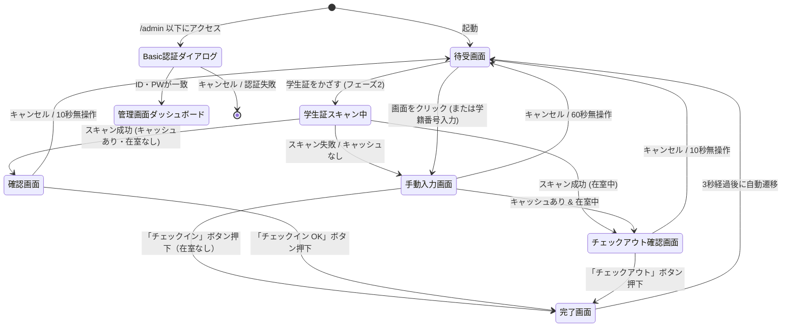

# ジム利用記録システム 画面設計

<!-- 変更履歴
  2026-06-25 更新:
  - §1 画面遷移図: チェックアウト確認画面（U-09）を追加
  - §2.2 手動入力画面: クラス欄を「直接入力」→「プルダウン選択」に変更、学年絞り込みの注記追加
  - §2.4 チェックアウト確認画面（U-09）を新規追加
  - §2.5 管理画面: タブにゴミ箱・マスタ管理を追加、削除操作を論理削除に変更
-->

利用者が操作するインターフェース（設置端末用）と、管理者が操作するWeb管理画面のレイアウトおよび遷移図です。

---

## 1. 画面遷移図



* **Basic認証ダイアログ**: ブラウザ標準のユーザー名/パスワード入力画面が表示されるため、独自のログイン画面は実装しません。

---

## 2. 各画面のレイアウト設計

### 2.1 待受画面（U-01）
利用者がジムに来た時に最初に目にする画面です。
オフライン時は、画面の右下に「オフライン動作中（未送信: X件）」とステータスが表示されます。

#### 【レイアウトイメージ（フェーズ1）】
```
+-----------------------------------------------------------------+
|                                                                 |
|                  WELCOME TO GYM RECORD SYSTEM                   |
|                                                                 |
|               [ 学籍番号を入力してチェックイン ]                |
|                                                                 |
|                     +---------------------+                     |
|                     |  学籍番号 (例: 12345) |                     |
|                     +---------------------+                     |
|                                                                 |
|                         [ 手動入力で進む ]                      |
|                                                                 |
|                                         [● ONLINE]              |
|                      ※オフライン時は [● OFFLINE (未送信3件)]   |
+-----------------------------------------------------------------+
```

---

### 2.2 手動入力画面（U-04）
初回利用者や、画像スキャンがうまくいかなかった場合に入力する画面です。
学科・学年・クラスはすべてマスタから選択式で提供されます（手入力不可）。

#### 【レイアウトイメージ】
```
+-----------------------------------------------------------------+
|  < 戻る                                       60秒後に戻ります  |
|                                                                 |
|                     ジム利用 登録フォーム                       |
|                                                                 |
|    学籍番号:   +------------------------------------------+     |
|                | 20261001                                 |     |
|                +------------------------------------------+     |
|                *入力すると氏名・クラスが自動で補完されます      |
|                                                                 |
|    氏名:       +------------------------------------------+     |
|                | 山田 太郎                                |     |
|                +------------------------------------------+     |
|                                                                 |
|    学科:       [ 建築学科           v ]  ※マスタから選択       |
|    学年:       [ 2年                v ]  ※学科の修業年限で絞込 |
|    クラス:     [ A組                v ]  ※マスタから選択       |
|                                                                 |
|                     +-----------------------+                   |
|                     |     チェックイン      |                   |
|                     +-----------------------+                   |
|                                                                 |
+-----------------------------------------------------------------+
```

---

### 2.3 チェックアウト確認画面（U-09）
学籍番号入力後、未退室のチェックインが検出された場合に表示される画面です。

#### 【レイアウトイメージ】
```
+-----------------------------------------------------------------+
|  < 戻る                                       10秒後に戻ります  |
|                                                                 |
|                    チェックアウト確認                           |
|                                                                 |
|              現在、ジムに入室中の記録があります。               |
|                                                                 |
|              氏名:       山田 太郎                              |
|              チェックイン時刻: 06-25 13:00                      |
|                                                                 |
|                  +-----------------------------+                |
|                  |      チェックアウト          |                |
|                  +-----------------------------+                |
|                                                                 |
|                      [ キャンセル ]                            |
|                                                                 |
+-----------------------------------------------------------------+
```

---

### 2.4 管理画面ダッシュボード（A-02〜A-07）
Basic認証成功後に遷移する管理者専用ポータルです。タブで各機能を切り替えられます。独自のログアウト処理は行わず、ブラウザセッションを終了することでログアウトと見なします。

#### 【レイアウトイメージ（利用ログ一覧タブ）】
```
+-----------------------------------------------------------------+
|  ジム利用記録 - 管理パネル                                      |
|  [利用ログ一覧]  [学生キャッシュ管理]  [マスタ管理]  [ゴミ箱]  |
|-----------------------------------------------------------------+
|  検索フィルタ:                                                  |
|  日付:[2026-06-12] 学籍番号:[202610  ] 学科:[建築学科 v] [検索] |
|                                                                 |
|  +-----------------------------------------------------------+  |
|  | [ CSVダウンロード ]  [ 一括削除 ]  全 125 件              |  |
|  +-----------------------------------------------------------+  |
|  | □ | 利用日時       | 学籍番号 | 氏名   | クラス|IN/OUT|操作 |  |
|  |---+-----------------+----------+--------+-------+------+-----|  |
|  | □ | 06-25 15:40    | 20261001 | 山田   | 建築2A|在室中|[削除]|  |
|  | □ | 06-25 14:15    | 20261005 | 佐藤   | 国際1B|15:20 |[削除]|  |
|  | ...                                                       |  |
|  +-----------------------------------------------------------+  |
|  ※削除はゴミ箱に移動します（30日以内に復元可）               |
+-----------------------------------------------------------------+
```

#### 【レイアウトイメージ（マスタ管理タブ）】
```
+-----------------------------------------------------------------+
|  ジム利用記録 - 管理パネル                                      |
|  [利用ログ一覧]  [学生キャッシュ管理]  [マスタ管理]  [ゴミ箱]  |
|-----------------------------------------------------------------+
|  [学科マスタ]  [クラスマスタ]                                   |
|                                                                 |
|  学科一覧                              [ + 新規学科を追加 ]    |
|  +-----------------------------------------------------------+  |
|  | 学科名          | 修業年限 | 表示順 | 操作                 |  |
|  |-----------------+----------+--------+---------------------|  |
|  | 建築学科        | 2年制    | 1      | [編集] [削除]        |  |
|  | 国際学科        | 2年制    | 2      | [編集] [削除]        |  |
|  +-----------------------------------------------------------+  |
|                                                                 |
+-----------------------------------------------------------------+
```

#### 【レイアウトイメージ（ゴミ箱タブ）】
```
+-----------------------------------------------------------------+
|  ジム利用記録 - 管理パネル                                      |
|  [利用ログ一覧]  [学生キャッシュ管理]  [マスタ管理]  [ゴミ箱]  |
|-----------------------------------------------------------------+
|  ゴミ箱 (削除から30日以内のみ復元可能)                         |
|                                                                 |
|  +-----------------------------------------------------------+  |
|  | □ | 削除日時       | 種別   | 内容                        |  |
|  |---+-----------------+--------+-----------------------------|  |
|  | □ | 06-25 10:00    | ログ   | 山田太郎 06-25 13:00 チェックイン|  |
|  | □ | 06-24 09:30    | キャッシュ | 佐藤花子 (20261005)    |  |
|  +-----------------------------------------------------------+  |
|  [ 選択した項目を復元 ]  [ 選択した項目を完全削除 ]            |
+-----------------------------------------------------------------+
```